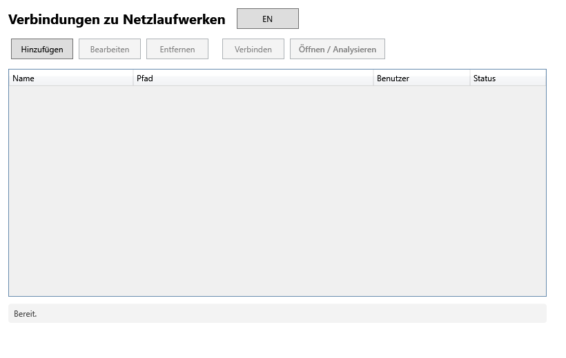

<div align="center">
  

  <h1>NetSweep: Netzwerkspeicher bereinigen</h1>
</div>

[🇬🇧 English Version](README.md)

Eine Windows-Desktop-App (WPF, .NET 8) für die Prüfung und Bereinigung von Netzlaufwerken: NAS-Freigaben, UNC-Pfade, SharePoint-Bibliotheken und DFS-Namespaces. Verbindungen verwalten, Speicherbelegung visualisieren, Duplikate erkennen und veraltete Dateien mit Audit-Protokoll entfernen.

Konzipiert für Microsoft-Enterprise-Umgebungen. Unterstützt SharePoint Online-Laufwerke und OneDrive for Business, ausgerichtet an den [Microsoft Purview Datenverwaltungsempfehlungen](https://learn.microsoft.com/de-de/microsoft-365/compliance/manage-data-governance).

[](https://github.com/9t29zhmwdh-coder/NetSweep/actions)     


> **So läuft es:** NetSweep ist eine native Windows-Desktop-App (WPF), kein Server und kein Browser-Tool. Sie öffnet ihr eigenes Fenster wie jedes installierte Programm, ohne Tray-Icon oder Hintergrunddienst; sie scannt und bereinigt nur, während du sie aktiv ausführst.



---

> 💾 [**Installer herunterladen**](https://github.com/9t29zhmwdh-coder/NetSweep/releases/latest/download/NetSweep-Setup.exe) (NetSweep-Setup.exe, immer das neueste Release): unsigniert, Windows SmartScreen zeigt beim ersten Start eine "Unbekannter Herausgeber"-Warnung. Oder selbst aus dem Quellcode bauen, siehe Erste Schritte unten.

---

> 🌱 Neu hier? → [Schritt-für-Schritt-Anleitung für Einsteiger](GETTING_STARTED.md)

---

**In der Praxis:** du fügst einmal deine NAS-/UNC-/SharePoint-/DFS-Pfade hinzu, NetSweep scannt sie und zeigt Speicherbelegung, Duplikate (per SHA-256-Hash) und veraltete Dateien nach Alter oder Muster; du prüfst und bestätigst, bevor irgendetwas gelöscht, quarantiniert oder gesichert wird, nichts wird automatisch entfernt.

---

## Funktionen

| Funktion | Beschreibung |
|----------|--------------|
| **Verbindungsverwaltung** | Mehrere NAS / UNC / DFS / SharePoint-Pfade anlegen, bearbeiten und verbinden |
| **Speichervisualisierung** | Aggregierte Speicherbelegung je Ordner mit Prozentanteil |
| **Dateifilter** | Nach Alter (Tage), Grösse, Endung oder Dateinamensmuster filtern |
| **Duplikaterkennung** | SHA-256-Hash-Vergleich mit genauem Überblick über freigebbaren Speicher |
| **Leere Ordner** | Leere Verzeichnisbäume auflisten und gesammelt entfernen |
| **Dateiaktionen** | Endgültig löschen (zweifache Bestätigung), Quarantäne, Kopieren/Backup, CSV-Export |

---

## Enterprise-Anwendungsfälle

- **SharePoint / OneDrive for Business**: SharePoint-Dokumentbibliotheken via UNC oder Laufwerksbuchstabe scannen; grosse, veraltete oder doppelte Dateien vor einer Migration identifizieren
- **DFS-Namespace-Unterstützung**: Verbindung zu `\\domain\dfs\...`-Pfaden als Standard-UNC-Verbindung
- **Vor-Migrations-Inventarisierung**: CSV-Berichte für Fileshare-zu-SharePoint- oder OneDrive-Migrationen exportieren
- **Speicher-Governance**: Regelmässige Prüfung von Netzwerkfreigaben mit exportierbaren Berichten für den IT-Betrieb

---

## Microsoft-Ökosystem-Kompatibilität

| Komponente | Unterstützung |
|------------|---------------|
| Windows 10 / 11 | Native WPF-App |
| SharePoint-Laufwerke | Vollständig, via gemapptem UNC-Pfad |
| OneDrive for Business | Vollständig, via Sync-Ordner oder Bibliotheks-Mapping |
| DFS-Namespaces | Vollständig, via Standard-UNC-Auflösung |
| Windows DPAPI | Zugangsdaten-Verschlüsselung im Ruhezustand |
| Entra ID / AD-verbundene Geräte | Funktioniert auf domain- und AAD-verbundenen Geräten |

---

## Sicherheit

- Zugangsdaten werden mit **Windows DPAPI** (CurrentUser-Scope) verschlüsselt und nie im Klartext gespeichert
- Verbindungsprofile unter `%AppData%\NetSweep\connections.json`, von der Versionskontrolle ausgeschlossen
- **Endgültiges Löschen ohne Rückgängig**: zweifache Bestätigung erforderlich; Quarantäne-Option verfügbar
- Konzipiert für **Minimal-Privilege-Konten**: Lese- und Schreibzugriff nur auf die Ziel-Freigabe
- Keine ausgehenden Netzwerkverbindungen, vollständig offline

---

## Voraussetzungen

- Windows 10 / 11
- [.NET 8 Desktop Runtime](https://dotnet.microsoft.com/download/dotnet/8.0) (oder self-contained veröffentlichen)
- Visual Studio 2022 (17.8+) mit Workload **".NET-Desktopentwicklung"** *(nur zum Bauen)*

---

## Erste Schritte

```bash
# Projektmappe öffnen
NetSweep.sln   # → Visual Studio → F5

# CLI-Build
dotnet build
dotnet run --project NetSweep

# Self-contained Einzeldatei publizieren
dotnet publish NetSweep/NetSweep.csproj -c Release -r win-x64 --self-contained true -p:PublishSingleFile=true
```

---

## Deinstallation / Aufräumen

- Bei Installation über `NetSweep-Setup.exe`: Deinstallation über Windows-Einstellungen → Apps, oder über den erstellten Uninstaller-Eintrag
- `%AppData%\NetSweep\` löschen, um gespeicherte Verbindungsprofile zu entfernen; gespeicherte Passwörter sind DPAPI-verschlüsselt, werden aber mit diesem Ordner ebenfalls gelöscht
- NetSweep verändert nie Dateien auf deinen Netzwerkfreigaben, ausser du bestätigst explizit eine Löschen-/Quarantäne-/Backup-Aktion; es gibt keinen weiteren lokalen Zustand zum Aufräumen

---

## Projektstruktur

```
NetSweep.sln
└─ NetSweep/
   ├─ App.xaml(.cs)       Einstiegspunkt: Welcome → Hauptfenster
   ├─ Models/             Datenmodelle (Connection, FileEntry, FolderNode, ScanResult)
   ├─ Services/           Geschäftslogik (Scan, Duplikate, FileOps, Verschlüsselung, CSV)
   ├─ ViewModels/         MVVM (MainViewModel, AnalysisViewModel, RelayCommand)
   ├─ Views/              XAML-Fenster (Welcome, Main, ConnectionEdit, Analysis)
   └─ Helpers/            Hilfsfunktionen (ByteSize-Formatierung, Pfad-Normalisierung)
```

---

## Roadmap

- [ ] Geplante/automatische Scans mit E-Mail-Benachrichtigung
- [ ] Inkrementelles Backup mit Versionierung
- [ ] Microsoft Graph API-Integration für SharePoint-Inventarisierung
- [ ] Audit-Protokoll für alle Lösch- und Verschiebeaktionen (CSV + Ereignisprotokoll)
- [ ] Dateistatistiken mit Diagrammvisualisierung
- [ ] Paralleler Scan mehrerer Pfade
- [ ] Intune / SCCM-Bereitstellungspaket (MSIX)

---

**Autor:** [Rafael Yilmaz](https://github.com/9t29zhmwdh-coder) · **Status:** Active ·  · **Lizenz:** MIT
