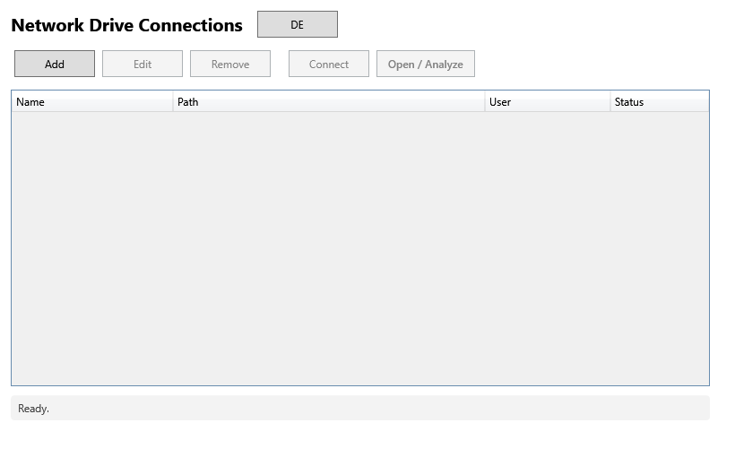

<div align="center">
  

  <h1>NetSweep: Network Storage Cleanup</h1>
</div>

> 🇩🇪 [Deutsche Version](README.de.md)

A Windows desktop application (WPF, .NET 8) for auditing and cleaning up network drives: NAS shares, UNC paths, mapped SharePoint libraries and DFS namespaces. Manage connections, visualize storage usage, detect duplicates, and remove stale files with full audit-trail support.

Designed for enterprise Microsoft environments. Supports SharePoint Online mapped drives and OneDrive for Business, aligned with [Microsoft Purview data lifecycle management](https://learn.microsoft.com/en-us/microsoft-365/compliance/manage-data-governance) recommendations.

[](https://github.com/9t29zhmwdh-coder/NetSweep/actions)     




---

> 💾 [**Download the installer**](https://github.com/9t29zhmwdh-coder/NetSweep/releases/latest/download/NetSweep-Setup.exe) (NetSweep-Setup.exe, always the latest release) — unsigned, so Windows SmartScreen will show an "Unknown Publisher" warning on first run. Or build from source, see Getting Started below.

---

> 🌱 New here? → [Step-by-step guide for beginners](GETTING_STARTED.md)

---

## Features

| Feature | Description |
|---------|-------------|
| **Connection Management** | Add, edit and connect to multiple NAS / UNC / DFS / SharePoint-mapped paths |
| **Storage Visualization** | Aggregated storage usage per folder with percentage share and size breakdown |
| **File Filters** | Filter by age (days), size, extension or filename pattern |
| **Duplicate Detection** | SHA-256 hash comparison; shows exactly how much space is recoverable |
| **Empty Folder Cleanup** | List and batch-remove empty directory trees |
| **File Actions** | Permanently delete (double confirmation), quarantine to staging path, copy/backup, CSV export |

---

## Enterprise Use Cases

- **SharePoint / OneDrive for Business**: scan mapped SharePoint document libraries via UNC or drive letter; identify oversized, outdated, or duplicate files before migration
- **DFS Namespace Support**: connect to `\\domain\dfs\...` paths as standard UNC connections
- **Pre-Migration Auditing**: export CSV inventories for file-share to SharePoint or OneDrive migrations
- **Storage Governance**: schedule reviews of network shares and generate exportable reports for IT operations

---

## Microsoft Ecosystem Compatibility

| Component | Support |
|-----------|---------|
| Windows 10 / 11 | Native WPF app |
| SharePoint mapped drives | Full support via mapped UNC path |
| OneDrive for Business | Full support via sync folder or mapped library |
| DFS Namespaces | Full support via standard UNC resolution |
| Windows DPAPI | Credential encryption at rest |
| Entra ID / AD joined devices | Works on domain-joined and AAD-joined machines |

---

## Security

- Credentials are encrypted with **Windows DPAPI** (CurrentUser scope) and never stored in plain text
- Connection profiles stored at `%AppData%\NetSweep\connections.json`, excluded from version control
- **Permanent delete has no undo**: requires double confirmation; quarantine option available
- Designed for **least-privilege accounts**: read + write access only to the targeted share
- No outbound network calls, runs fully offline

---

## Requirements

- Windows 10 / 11
- [.NET 8 Desktop Runtime](https://dotnet.microsoft.com/download/dotnet/8.0) (or publish self-contained)
- Visual Studio 2022 (17.8+) with **.NET Desktop Development** workload *(for building)*

---

## Getting Started

```bash
# Open solution
NetSweep.sln   # → Visual Studio → F5

# CLI build
dotnet build
dotnet run --project NetSweep

# Self-contained single-file publish
dotnet publish NetSweep/NetSweep.csproj -c Release -r win-x64 --self-contained true -p:PublishSingleFile=true
```

---

## Project Structure

```
NetSweep.sln
└─ NetSweep/
   ├─ App.xaml(.cs)       Entry point: Welcome → Main window
   ├─ Models/             Data models (StorageConnection, FileEntry, FolderNode, ScanResult, DuplicateGroup)
   ├─ Services/           Business logic (ScanService, DuplicateFinder, FileOperationService,
   │                      ConnectionStore, CredentialService, NetworkConnectionService, ReportService)
   ├─ ViewModels/         MVVM (ViewModelBase, MainViewModel, AnalysisViewModel, Converters)
   ├─ Views/              XAML windows (Welcome, Main, ConnectionEdit, Analysis)
   └─ Helpers/            Utilities (ByteSize formatting, path normalization, RelayCommand)
```

---

## Roadmap

- [ ] Scheduled / automatic scans with email notification
- [ ] Incremental backup with versioning
- [ ] Microsoft Graph API integration for SharePoint inventory
- [ ] Audit log for all delete / move actions (CSV + Event Log)
- [ ] File type statistics with chart visualization
- [ ] Parallel scan of multiple paths
- [ ] Intune / SCCM deployment package (MSIX)

---

**Author:** [Rafael Yilmaz](https://github.com/9t29zhmwdh-coder) · **Status:** Active ·  · **License:** MIT
